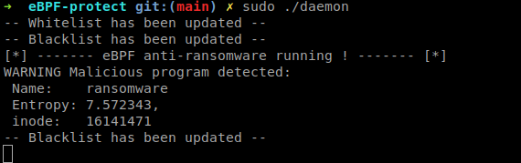

# eBPF Zero-Trust Ransomware Executioner 🛡️🐧



A Proof-of-Concept Linux Endpoint Detection and Response (EDR) daemon built from scratch using **eBPF**, **Ring Buffers**, and **Shannon Entropy** math.

Instead of relying on static malware signatures, this EDR mathematically profiles disk writes in real-time. If an untrusted binary begins writing highly randomized data (a hallmark of ransomware encryption), the eBPF kernel probe intercepts the system call and flags it as malicious. The user-space daemon then adds the binary's Inode to a blacklist, and any future write attempts are instantly killed in kernel space with zero latency.

## Architecture

This project is engineered as a **Stateless Zero-Trust Executioner** to maximize performance and avoid complex memory leaks in the kernel.

* **The Golden Image (Whitelist):** During the build phase (`make`), the system dynamically profiles your Linux environment, resolving symlinks to discover the true physical Inodes of standard OS binaries, package managers, browsers, and IDEs. These are loaded into an eBPF Map.
* **The Kernel Hook:** An eBPF program is attached to `tracepoint/syscalls/sys_enter_write`. It extracts the true physical Inode of the executing binary (`task->mm->exe_file->f_inode->i_ino`).
    * If the binary is in the Whitelist, it is allowed to write natively with zero latency.
    * If the binary is in the Blacklist, it is instantly killed via `bpf_send_signal(9)`.
    * If the binary is unknown, the eBPF probe pauses, samples 512 bytes of the payload, and sends it to Userland via a high-speed Ring Buffer.
* **The Userland Judge:** The C daemon reads the buffer and calculates the **Shannon Entropy** of the data. If the entropy exceeds `7.3` (highly random/encrypted data), the daemon adds the binary's Inode to the Blacklist and updates the kernel Map.
* **Hot-Reloading:** The daemon uses `epoll` and `inotify` to multiplex Ring Buffer events and configuration changes (`whitelist.txt`, `blacklist.txt`) asynchronously on a single thread.

---

## Prerequisites

To compile and run this EDR, you need a modern Linux kernel (5.8+) and the standard eBPF toolchain.

```bash
# Ubuntu / Debian
sudo apt update
sudo apt install -y clang llvm gcc make bpftool libbpf-dev linux-headers-$(uname -r)
```

---

## Build Instructions

The provided `Makefile` automates the entire setup process. It downloads the necessary `eunomia-bpf` compilation tools, extracts your kernel's BTF (`vmlinux.h`), generates the system whitelist, and compiles the daemon.

```bash
# 1. Clone the repository
git clone https://github.com/justthinkinghard/eBPF-protect.git
cd eBPF-protect

# 2. Build the project
# This will automatically profile your system to build whitelist.txt
make
```

---

## Usage & Live Fire Testing

**Warning:** This is a live executioner. It will ruthlessly kill processes that are not in the whitelist if they attempt to write compressed or encrypted data. 

### 1. Start the EDR Daemon
You must run the daemon as `root` to load the eBPF programs into the kernel.
```bash
sudo ./daemon
```
*Leave this running in its own terminal window.*

### 2. Launch the Ransomware Simulator
The repository includes a compiled dummy ransomware simulator (`test/test`). This binary is purposefully *not* added to the whitelist. It attempts to read pure chaos from `/dev/urandom` and write it to `safe_test.txt` to trigger the executioner.

In a separate terminal, run:
```bash
./test/test
```

**Expected Result:**
The simulator will attempt its first write, the eBPF probe will intercept it, Userland will calculate an entropy of ~7.99, and the daemon will add the simulator's Inode to the blacklist.

**Output from the EDR daemon terminal:**
```text
PID 10543, command test, fd 3
Blacklist updated
```

If you attempt to run `./test/test` again, the eBPF probe will recognize its Inode in the Blacklist map and instantly assassinate it in kernel space, completely bypassing Userland.

**Output from the simulator terminal:**
```text
Killed
```

---

## Project Structure
* `src/ebpf/check.bpf.c`: The kernel-space eBPF program.
* `src/daemon/daemon.c`: The user-space C daemon (Entropy calculations, Epoll, Maps).
* `include/linker.h`: The shared IPC structures for the Ring Buffer.
* `test/test.c`: The dummy ransomware payload.
* `Makefile`: The automated build and profiling pipeline.

---

## ⚠️ Architectural Tradeoffs
* **The Asynchronous "First-Write" Race Condition**: Because eBPF runs in the kernel, it cannot sleep or wait for Userland to calculate math. Therefore, when an unknown binary writes data, the first file write is allowed through while the payload is simultaneously sent to Userland. If flagged, the Userland daemon blacklists the process, and the next write is killed. Because real ransomware encrypts entire disks, sacrificing a single data chunk is an acceptable tradeoff to avoid paralyzing the OS with blocking kernel hooks.
* **The Compression Paradox:** Shannon Entropy cannot mathematically distinguish between an encrypted file and a highly compressed archive (like `.zip` or `zstd`). To prevent the EDR from killing system tools like `apt` or `dpkg`, the deployment script strictly enforces a Golden Image whitelist of standard directories (`/usr/bin`, `/snap/`, `/usr/lib/`, etc.). 
* **Interpreter Resolution:** This EDR uses a stateless architecture to maximize speed and prevent memory leaks. Because it does not hook `execve` to track process state trees, it whitelists interpreters (like `python3` and `bash`) globally.